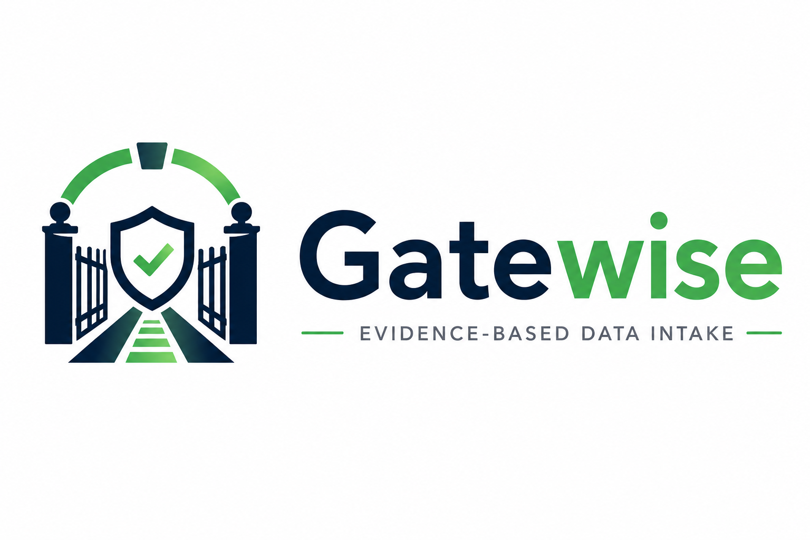

<p align="center">
  
</p>
<p align="center">
<b>AI-Powered Data Intake & Trust Review</b>
</p>

<p align="center">


</p>


## Overview

GateWise is an AI-powered, multi-agent platform that evaluates incoming business data before it enters operational systems.

Rather than simply validating records, GateWise analyzes data quality, detects inconsistencies, identifies duplicates, assigns confidence scores, and recommends when human review is required.

The goal is to help organizations make better decisions about which records can be trusted.

---

## Why GateWise?

Organizations receive operational data from many sources:

* CSV exports
* Excel workbooks
* Vendor reports
* PDFs
* Images
* Third-party systems

Before importing this information, teams often spend hours manually:

* Cleaning inconsistent values
* Identifying duplicates
* Checking missing fields
* Reviewing suspicious records
* Deciding which records can be trusted

GateWise automates this review process while keeping humans involved when confidence is low.

---

## Multi-Agent Architecture

GateWise uses specialized AI agents, each responsible for one task.

| Agent              | Responsibility                                     |
| ------------------ | -------------------------------------------------- |
| 🔒 Security Agent  | Screens records for sensitive or risky information |
| 🔍 Evidence Agent  | Collects observable data quality issues            |
| 🎯 Trust Agent     | Calculates confidence scores                       |
| 🤔 Challenge Agent | Highlights assumptions and uncertainty             |
| 👤 Review Agent    | Determines whether human review is required        |
| 🧬 Duplicate Agent | Detects potential duplicate records                |

---

## Workflow

```text
Incoming Data
        │
        ▼
Security Agent
        │
        ▼
Evidence Agent
        │
        ▼
Trust Agent
        │
        ▼
Challenge Agent
        │
        ▼
Review Agent
        │
        ▼
Duplicate Agent
        │
        ▼
Trust Report
```

---

## Features

* AI-powered trust evaluation
* Multi-agent workflow
* Duplicate detection
* Evidence-based confidence scoring
* Human review recommendations
* Automated trust report generation
* Interactive Streamlit dashboard

---

## Technology Stack

* Python
* Streamlit
* Pandas
* Git
* Modular Agent Architecture

---

## Project Structure

```
GateWise
│
├── app/
│   ├── security_agent.py
│   ├── evidence_agent.py
│   ├── trust_agent.py
│   ├── challenge_agent.py
│   ├── review_agent.py
│   ├── duplicate_agent.py
│   ├── trust_scorer.py
│   └── report_generator.py
│
├── assets/
├── docs/
├── outputs/
├── sample-data/
├── screenshots/
├── streamlit_app.py
└── README.md
```

---

## Sample Results

* Records Processed: **10**
* High Confidence: **6**
* Medium Confidence: **4**
* Low Confidence: **0**
* Duplicate Records Detected: **1**

---

## Roadmap

* PDF document ingestion
* Excel ingestion
* AI-powered reasoning using Gemini
* Airtable integration
* Human-in-the-loop approval workflow
* REST API

---

## Status

🚧 Active Development

GateWise is an experimental AI project exploring trustworthy, explainable data intake using a modular multi-agent architecture.
